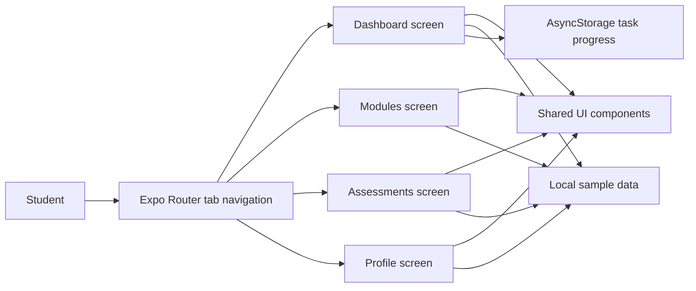
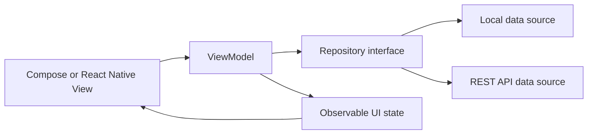
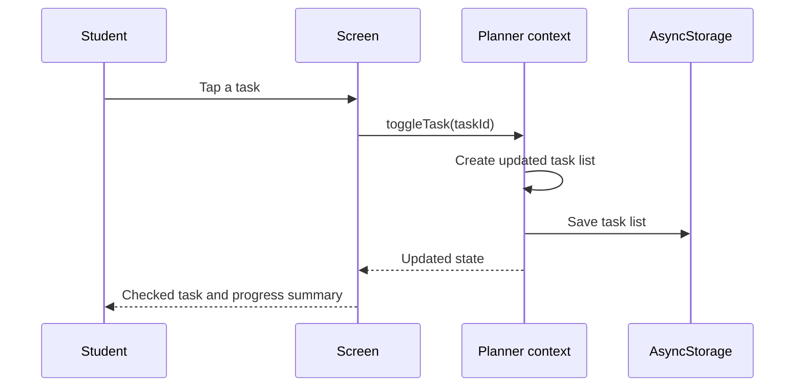
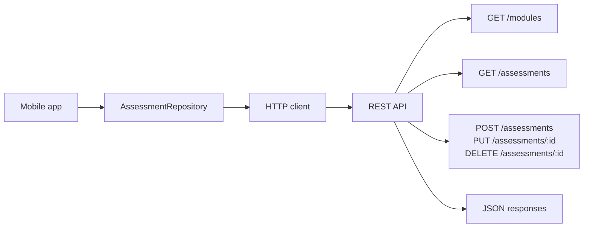

# UniPlanner Architecture Notes

This document describes both the intentionally simple Week 1 design and the target structure for later teaching weeks.

## Week 1 component view



## Target MVVM view for Week 2+



The first build does not force this structure early. That is deliberate: students first see the problem of screen-level data access, then have a concrete reason to refactor.

## Data flow



## API interaction target for Week 4



## Suggested package structure

```text
artifacts/uniplanner/
├── app/                 # Routes and screen composition
├── components/          # Reusable visual components
├── context/             # Shared Week 1 state
├── data/                # Week 1 models and sample data
├── constants/           # Theme tokens
└── hooks/               # Theme and reusable hooks

Later architecture:
├── domain/              # Entities and business rules
├── data/                # Repository implementations and DTO mapping
├── presentation/        # ViewModels and screen state
└── tests/               # Unit and integration tests
```